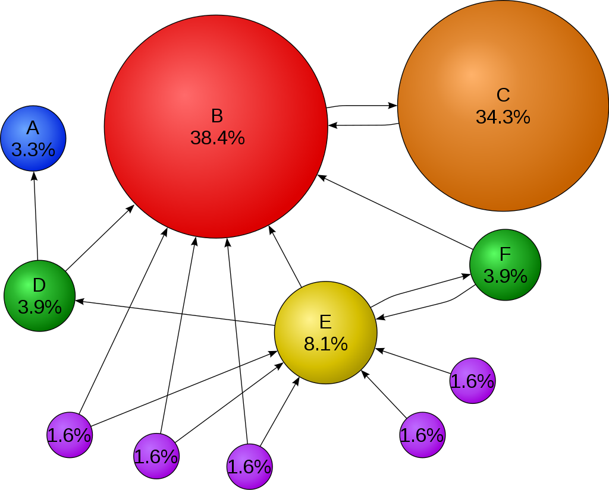

# page_rank

<p align="center">
    
     
</p>

## Description

Implementation and explanation of the Google's Page Rank algorithm for website reference.

## Page rank

The page rank is a Google algorithm for website referencing in google search engine.
I made this program in a learning goal, its implementation is interesting to apprehend the basis of website reference.

<p align="center">
    
</p>

**Note**
> Nowaday's google use other powerfuller algorithms.

## Project and quick start

To start each program, please install Python (at least version 3.8):
<https://www.python.org/downloads/>

There is only one package needed :
- numpy

You can install it using the pip python package manager

```bash
pip install numpy
```

or run the following command at the project root:

```bash
pip install -r requirements.txt
```

You'll also need an IDE like Pycharm, VsCode or any other to start the Jupyter Notebook files.

The project is composed of two main files.

The first one is made for the basis learning of the Page Rank algorithm with the basis notions :

- website successors and predecessors referencing influence
- the spider-trap and teleport
- the dead ends

The second file is a test of the algorithm for a bigger set of website than the previous example.
It needs the `hollins.dat` file to work, of course this files is provided with the project.

**Note**
> If you want to learn more about Google's current algorithm, check the google link in the `documentations` section.

## Documentations

Wikipedia:  
<https://en.wikipedia.org/wiki/PageRank>

Google:  
<https://www.google.com/search/howsearchworks/>

Search Engine Land:  
<https://searchengineland.com/what-is-google-pagerank-a-guide-for-searchers-webmasters-11068>
